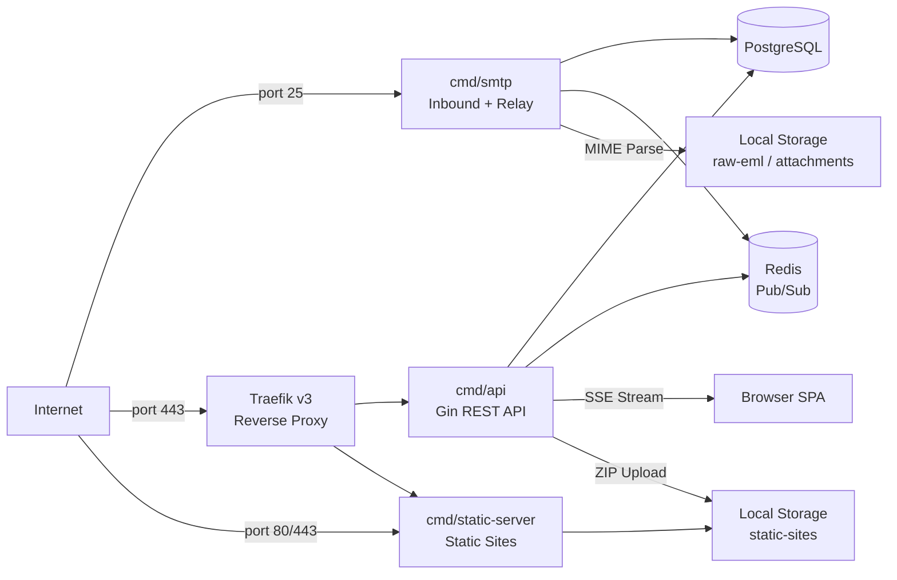

# GoMail

<div align="center">

**Self-hosted email SaaS — inbound mailboxes, SMTP relay, API keys, realtime updates & static website hosting.**

[](https://go.dev/)
[](https://www.postgresql.org/)
[](https://redis.io/)
[](https://www.docker.com/)
[](LICENSE)

</div>

---

## Table of Contents

- [Overview](#overview)
- [Architecture](#architecture)
- [Features](#features)
- [Quick Start (Local)](#quick-start-local)
- [VPS Deployment](#vps-deployment)
- [API Reference](#api-reference)
- [SMTP Relay / Submission](#smtp-relay--submission)
- [Static Website Hosting](#static-website-hosting)
- [Environment Variables](#environment-variables)
- [Development](#development)
- [Scripts Reference](#scripts-reference)

---

## Overview

GoMail is a batteries-included, self-hosted email platform. Run your own inbound email service with custom domains, catch-all mailboxes, real-time push notifications, an SMTP submission relay with API-key auth, DKIM signing, and static site hosting — all from a single Go binary.

**Three runtimes, one codebase:**

| Binary | Role | Default Port |
|---|---|---|
| `api` | REST API, SSE realtime events, admin panel | `8080` |
| `smtp` | Inbound SMTP server + SMTP AUTH relay | `25` / `2525` (dev) |
| `static-server` | Serves published static sites, resolves custom domains | `8090` |

## Architecture



## Features

### 📧 Inbound Email

- SMTP server accepting mail on port 25 (prod) / 2525 (dev)
- Full MIME parsing with multipart, attachments, and inline content
- HTML sanitization via [bluemonday](https://github.com/microcosm-cc/bluemonday) with remote image scrubbing
- Attachment storage with extension and content-type validation
- Email threading (In-Reply-To / References)
- Reply tracking — know if a sent message was a reply to an inbound email

### 🔐 Authentication & Security

- JWT access tokens + refresh token rotation with session chain revocation
- Password hashing with bcrypt
- Rate-limited auth endpoints (token bucket)
- API key management with scoped permissions (`send_email`, `full_access`)
- One-time key reveal — SHA-256 hashed at rest, never stored in plaintext
- Session-protected routes + API-key-protected routes

### 📤 SMTP Relay / Submission

- SMTP AUTH on port 587 (STARTTLS) and port 465 (implicit TLS)
- API keys as SMTP credentials (username: `api`, password: the key)
- Outbound delivery: direct MX lookup or upstream relay
- DKIM signing for outbound messages (per-domain RSA keypairs)
- Real-time usage counters per API key
- Configurable daily send limits

### 🌐 Static Website Hosting

- Upload ZIP archives → auto-publish to subdomain
- Atomic publish with staging → live rename (rollback on failure)
- Custom domain binding with DNS TXT/AAAA verification
- Automatic Let's Encrypt SSL via Traefik or native nginx+Certbot
- ZIP bomb protection (max archive size, max extracted size, max file count)
- Forbidden extension blocking (`.php`, `.sh`, `.exe`, etc.)
- Path traversal prevention (Zip Slip)
- Thumbnail generation for published sites

### 🛡️ Admin Panel

- Super admin user management (list, activate/deactivate, set quotas, delete)
- Attachment flag override
- Per-user quotas: domains, inboxes, message size, attachment size, storage, websites

### ⚡ Realtime

- SSE (Server-Sent Events) stream via Redis pub/sub
- New email notifications pushed to browser in real time
- Query-token auth for `EventSource` (no custom headers needed)

---

## Quick Start (Local)

### Prerequisites

- Go 1.26+
- Docker & Docker Compose
- Node.js (for JS syntax checks only)

### 1. Clone & configure

```bash
git clone <repo-url> gomail
cd gomail

cp .env.example .env          # production defaults
cp .env.dev.example .env.dev  # local overrides
```

### 2. Start infrastructure

```bash
make dev-up
```

Starts PostgreSQL 16 and Redis 7 in Docker.

### 3. Build & run

```bash
./start.sh
```

This builds the `api` and `smtp` binaries, then starts:
- **API** on `http://localhost:8080`
- **SMTP** on port `2525`

Logs are written to `.run/`.

### 4. Verify

```bash
curl http://localhost:8080/healthz
# {"ok":true}
```

Open `http://localhost:8080/app/` in your browser. The default super admin account is seeded from `DEFAULT_ADMIN_EMAIL` / `DEFAULT_ADMIN_PASSWORD` in `.env.dev`.

---

## VPS Deployment

### Automated Install (Ubuntu/Debian)

[`install.sh`](./install.sh) provisions everything: Docker, Go, nginx, ufw, systemd services, TLS certificates.

```bash
sudo APP_DOMAIN=mail.example.com \
  SAAS_DOMAIN=example.com \
  SMTP_HOSTNAME=mx.example.com \
  SMTP_AUTH_HOSTNAME=smtp.example.com \
  DEFAULT_ADMIN_EMAIL=admin@example.com \
  ./install.sh
```

| Variable | Description |
|---|---|
| `APP_DOMAIN` | Primary web/API domain (e.g. `mail.example.com`) |
| `SAAS_DOMAIN` | Root SaaS domain (e.g. `example.com`) |
| `SMTP_HOSTNAME` | Public MX hostname (e.g. `mx.example.com`) |
| `SMTP_AUTH_HOSTNAME` | SMTP submission hostname (e.g. `smtp.example.com`) |
| `STATIC_SITES_BASE_DOMAIN` | (Optional) Wildcard base for hosted sites |
| `DEFAULT_ADMIN_EMAIL` | Super admin email for initial seed |
| `ENABLE_TLS` | Enable Let's Encrypt during install (default: `true`) |

### DNS Setup

| Record | Type | Target |
|---|---|---|
| `mail.example.com` | A | VPS IP |
| `mx.example.com` | A | VPS IP |
| `smtp.example.com` | A | VPS IP |
| `example.com` | A | VPS IP (optional — see routing below) |
| `example.com` | MX | `mx.example.com` (priority 10) |
| `*.sites.example.net` | A | VPS IP (for static sites) |

### Domain Routing (Nginx)

Nginx routes requests based on the `Host` header:

| Host header matches | Proxied to | Serves |
|---|---|---|
| `$APP_DOMAIN` (e.g. `mail.example.com`) | API (`:8080`) | Web app (login, dashboard, API) |
| `$SAAS_DOMAIN` (e.g. `example.com`) | API (`:8080`) | Web app — same as above |
| Any other host (`_` default) | static-server (`:8090`) | Static sites, custom domains, `*.sites.example.net` |

> **Note:** Both `APP_DOMAIN` and `SAAS_DOMAIN` route to the app. This means visiting `example.com` and `mail.example.com` both take you to the login page. The `SAAS_DOMAIN` is also the base for user email domains (e.g. `@example.com` mailboxes).

### Upgrade

```bash
sudo ./upgrade.sh
```

Supports archive-based deploys:

```bash
sudo DEPLOY_ARCHIVE=/home/admin/gomail-deploy.tgz ./upgrade.sh
```

Options: `RUN_TESTS=true` (run `go test` before restart), `RESTART_INFRA=true` (full infra restart).

### SSL Management

| Script | Purpose |
|---|---|
| [`ssl-fix.sh`](./ssl-fix.sh) | Re-request main app TLS certificate |
| [`wildcard-ssl.sh`](./wildcard-ssl.sh) | Manage wildcard SSL for `*.sites.example.net` |
| [`custom-domain-ssl.sh`](./scripts/custom-domain-ssl.sh) | Per-domain SSL for exact custom domains |

---

## API Reference

### Authentication

| Method | Path | Auth | Description |
|---|---|---|---|
| `POST` | `/api/auth/register` | None | Register new account |
| `POST` | `/api/auth/login` | None | Login, returns access + refresh tokens |
| `POST` | `/api/auth/refresh` | None | Rotate refresh token |
| `GET` | `/api/me` | Bearer | Get current user profile |
| `POST` | `/api/auth/logout` | Bearer | Invalidate refresh token chain |
| `POST` | `/api/auth/change-password` | Bearer | Change password |

### Domains

| Method | Path | Auth | Description |
|---|---|---|---|
| `GET` | `/api/domains` | Bearer | List user domains |
| `POST` | `/api/domains` | Bearer | Add custom domain |
| `GET` | `/api/domains/:id` | Bearer | Get domain details |
| `POST` | `/api/domains/:id/verify` | Bearer | Verify domain ownership (TXT) |
| `POST` | `/api/domains/:id/verify-a` | Bearer | Verify A record |
| `POST` | `/api/domains/:id/verify-mx` | Bearer | Verify MX record |
| `GET` | `/api/domains/:id/email-auth` | Bearer | Get SPF/DKIM instructions |
| `POST` | `/api/domains/:id/email-auth/dkim/generate` | Bearer | Generate DKIM keypair |
| `POST` | `/api/domains/:id/email-auth/verify` | Bearer | Verify SPF + DKIM DNS records |
| `DELETE` | `/api/domains/:id` | Bearer | Delete domain |

### Inboxes & Email

| Method | Path | Auth | Description |
|---|---|---|---|
| `GET` | `/api/inboxes` | Bearer | List inboxes |
| `POST` | `/api/inboxes` | Bearer | Create inbox (catch-all or specific) |
| `PATCH` | `/api/inboxes/:id` | Bearer | Update inbox |
| `DELETE` | `/api/inboxes/:id` | Bearer | Delete inbox |
| `GET` | `/api/conversations` | Bearer | List email conversations (threaded) |
| `GET` | `/api/emails` | Bearer | List emails for an inbox |
| `GET` | `/api/emails/:id` | Bearer | Get full email with sanitized HTML |
| `GET` | `/api/emails/:id/thread` | Bearer | Get full thread for an email |
| `GET` | `/api/emails/:id/reply-status` | Bearer | Check if email was replied to |
| `POST` | `/api/emails/:id/reply` | Bearer | Reply to an email |
| `PATCH` | `/api/emails/:id/read` | Bearer | Mark as read |
| `DELETE` | `/api/emails/:id` | Bearer | Delete email |
| `GET` | `/api/emails/:id/attachments/:aid/download` | Bearer | Download attachment |
| `GET` | `/api/dashboard` | Bearer | Dashboard stats |
| `GET` | `/api/outbound/status` | Bearer | Outbound delivery status |

### Realtime

| Method | Path | Auth | Description |
|---|---|---|---|
| `GET` | `/api/events/stream` | Query token | SSE stream of realtime events |

### Admin (requires Bearer + admin role)

| Method | Path | Auth | Description |
|---|---|---|---|
| `GET` | `/api/admin/users` | Super Admin | List all users |
| `PATCH` | `/api/admin/users/:id/status` | Super Admin | Activate/deactivate user |
| `PATCH` | `/api/admin/users/:id/quotas` | Super Admin | Update user quotas |
| `DELETE` | `/api/admin/users/:id` | Super Admin | Delete user |
| `PATCH` | `/api/admin/attachments/:id/override` | Admin | Override attachment flag |

---

## SMTP Relay / Submission

Users generate API keys and use them to submit outbound email through GoMail's SMTP relay.

### API Key Management

| Method | Path | Auth | Description |
|---|---|---|---|
| `POST` | `/api/api-keys` | Bearer | Create key (full key shown once) |
| `GET` | `/api/api-keys` | Bearer | List keys (prefix only) |
| `GET` | `/api/api-keys/:id` | Bearer | Get key details |
| `PATCH` | `/api/api-keys/:id` | Bearer | Update name/scope |
| `DELETE` | `/api/api-keys/:id` | Bearer | Delete key |
| `POST` | `/api/api-keys/:id/revoke` | Bearer | Revoke key |
| `GET` | `/api/api-keys/:id/usage` | Bearer | Get usage stats |

### Send Email (API)

```http
POST /api/send-email
X-Api-Key: go_xxxxxxxxxxxx
Content-Type: application/json

{
  "to": "recipient@example.com",
  "subject": "Hello from GoMail",
  "body": "<p>Email content with <b>HTML</b> support</p>"
}
```

### SMTP AUTH Credentials

Use any SMTP client with these settings:

| Setting | Value |
|---|---|
| Host | `smtp.your-domain.com` |
| Port | `587` (STARTTLS) or `465` (TLS) |
| Username | `api` |
| Password | Your full API key (`go_...`) |

---

## Static Website Hosting

### Lifecycle

1. **Upload** a ZIP archive via API
2. GoMail validates the archive (size, file count, forbidden extensions, zip-slip)
3. Content is extracted to a staging directory
4. On success, the staging directory is atomically renamed to live
5. The site is served at `https://<project-id>.<base-domain>`

### Custom Domains

- Bind a custom domain to your static project
- Verify ownership via DNS TXT record
- Optionally verify via AAAA record
- Activate SSL via Let's Encrypt (automatic or manual)

### Safety Guards

| Protection | Default Limit |
|---|---|
| Max archive size | Configurable (`STATIC_SITES_MAX_ARCHIVE_BYTES`) |
| Max extracted size | Configurable (`STATIC_SITES_MAX_EXTRACTED_BYTES`) |
| Max file count | Configurable (`STATIC_SITES_MAX_FILE_COUNT`) |
| Blocked extensions | `.php`, `.sh`, `.exe`, `.bat`, `.py`, etc. |
| Path traversal | Prevented (Zip Slip detection) |

---

## Environment Variables

<details>
<summary><b>Core</b></summary>

| Variable | Default | Description |
|---|---|---|
| `APP_ENV` | `development` | `production` or `development` |
| `APP_NAME` | `GoMail` | Application display name |
| `APP_BASE_URL` | `http://localhost:8080` | Public base URL |
| `HTTP_HOST` | `0.0.0.0` | API listen address |
| `HTTP_PORT` | `8080` | API listen port |
| `DATABASE_URL` | — | PostgreSQL connection string |
| `REDIS_ADDR` | `localhost:6379` | Redis address |

</details>

<details>
<summary><b>Auth & Security</b></summary>

| Variable | Default | Description |
|---|---|---|
| `JWT_SECRET` | — | JWT signing secret (min 32 chars in prod) |
| `ACCESS_TOKEN_TTL` | `15m` | Access token lifetime |
| `REFRESH_TOKEN_TTL` | `720h` | Refresh token lifetime |
| `DEFAULT_ADMIN_EMAIL` | — | Super admin email for seed |
| `DEFAULT_ADMIN_PASSWORD` | — | Super admin password for seed |

</details>

<details>
<summary><b>SMTP</b></summary>

| Variable | Default | Description |
|---|---|---|
| `SMTP_HOST` | `0.0.0.0` | Inbound SMTP listen address |
| `SMTP_PORT` | `2525` | Inbound SMTP port (25 in prod) |
| `SMTP_HOSTNAME` | `localhost` | Public MX hostname |
| `SMTP_AUTH_ENABLED` | `false` | Enable SMTP AUTH relay |
| `SMTP_AUTH_HOSTNAME` | — | Relay hostname for clients |
| `SMTP_AUTH_PORT` | `587` | Submission port (STARTTLS) |
| `SMTP_AUTH_TLS_PORT` | `465` | Submission port (implicit TLS) |
| `OUTBOUND_MODE` | `direct` | `direct` or `relay` |
| `OUTBOUND_RELAY_HOST` | — | Upstream relay host |
| `OUTBOUND_RELAY_PORT` | `587` | Upstream relay port |
| `DKIM_ENABLED` | `false` | Enable DKIM signing |
| `DKIM_SELECTOR` | `gomail` | DKIM selector |
| `DKIM_KEY_ENCRYPTION_SECRET` | — | Secret to encrypt DKIM private keys |

</details>

<details>
<summary><b>Static Sites</b></summary>

| Variable | Default | Description |
|---|---|---|
| `STATIC_SITES_ROOT` | `./data/static-sites` | Storage root for sites |
| `STATIC_SITES_BASE_DOMAIN` | — | Wildcard base domain |
| `STATIC_SERVER_ADDR` | `:8090` | Static server listen address |
| `STATIC_SITES_MAX_ARCHIVE_BYTES` | `104857600` | Max ZIP upload (100 MB) |
| `STATIC_SITES_MAX_EXTRACTED_BYTES` | `524288000` | Max extracted size (500 MB) |
| `STATIC_SITES_MAX_FILE_COUNT` | `10000` | Max files per site |

</details>

---

## Development

### Commands

```bash
make dev-up      # Start PostgreSQL + Redis
make dev-down    # Stop infrastructure
make api         # Run API server
make smtp        # Run SMTP server
make test        # Run all tests
make vet         # Run go vet
make check       # test + vet + JS syntax check
make e2e         # Manual end-to-end test
```

### Project Structure

```
cmd/
├── api/main.go           # HTTP API entry point
├── smtp/main.go          # SMTP server entry point
└── static-server/main.go # Static file server entry point

internal/
├── auth/                 # Password hashing, JWT, refresh tokens
├── config/               # Environment loading & validation
├── db/                   # GORM models, migrations, seeding
│   └── migrations/       # SQL migration files
├── dkimkeys/             # DKIM key generation & management
├── dns/                  # DNS record verification
├── http/
│   ├── handlers/         # Route handlers (auth, domains, emails, API keys, static projects)
│   └── middleware/       # Auth, API key auth, rate limiting
├── mail/
│   ├── outbound/         # Outbound message building & delivery
│   ├── parser/           # MIME parsing
│   └── service/          # Inbound message processing pipeline
├── realtime/             # Redis pub/sub & SSE
├── smtp/
│   ├── relay/            # Outbound SMTP relay + DKIM signing
│   ├── server/           # Inbound SMTP server + SMTP AUTH
│   └── session/          # SMTP session management
├── staticprojects/       # Static site lifecycle, DNS binding, thumbnails
└── storage/              # Filesystem storage abstraction

pkg/
├── logger/               # Structured logging
└── response/             # HTTP response helpers

web/                      # Vanilla JS SPA frontend
```

### Database

PostgreSQL is the source of truth. Migrations are in `internal/db/migrations/`. The API auto-migrates on startup via GORM.

### Demo Data

In development mode, a demo super admin is seeded automatically. Disable with `SEED_DEMO_DATA=false`.

---

## Scripts Reference

| Script | Purpose |
|---|---|
| [`install.sh`](./install.sh) | First-time VPS provisioning (Docker, Go, nginx, systemd, TLS) |
| [`upgrade.sh`](./upgrade.sh) | In-place upgrade from git or archive |
| [`start.sh`](./start.sh) | Local dev build & run |
| [`ssl-fix.sh`](./ssl-fix.sh) | Re-request main app TLS certificate |
| [`wildcard-ssl.sh`](./wildcard-ssl.sh) | Manage wildcard SSL for static sites |
| [`scripts/custom-domain-ssl.sh`](./scripts/custom-domain-ssl.sh) | Per-domain SSL provisioning |
| [`scripts/dev-smtp-sink.py`](./scripts/dev-smtp-sink.py) | Development SMTP sink for testing |
| [`scripts/manual_e2e.sh`](./scripts/manual_e2e.sh) | Manual end-to-end test script |

---

## License

MIT — see [LICENSE](LICENSE) for details.

## Project Status

| Product | Status |
|---|---|
| Inbound Email Hosting | ✅ Complete |
| SMTP Relay / Submission | ✅ Complete |
| Static Website Hosting | ✅ Complete |
| Rate Limiting | ✅ Implemented |
| Graceful Shutdown | ✅ All services |
| Typed Status Constants | ✅ Refactored |
| Connection Pool | ✅ Configured |
| Code Duplication | ✅ Cleaned up |

See [report.md](./report.md) for full analysis.
